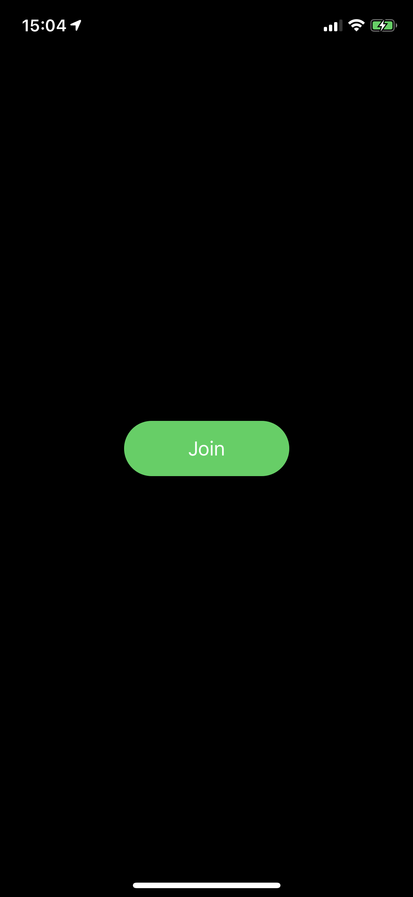
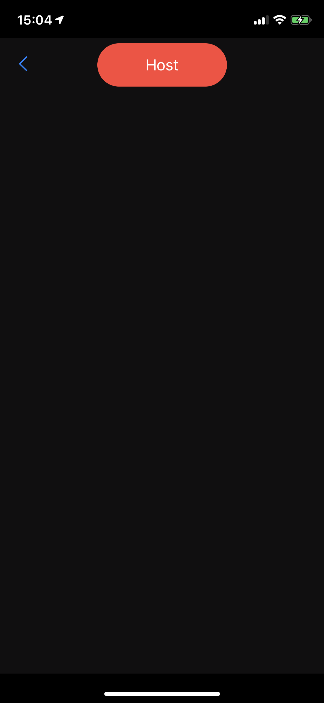
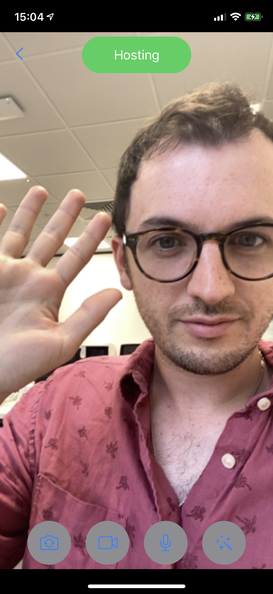
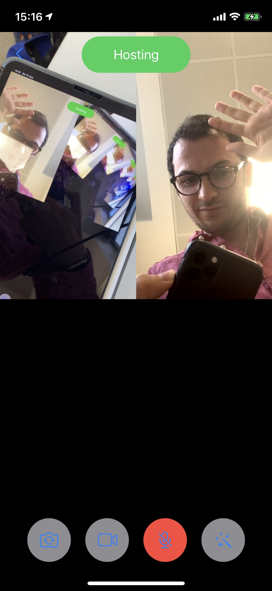

# Agora iOS Example

This iOS example covers joining and leaving a channel, becoming a broadcaster, adding beautify camera effects, and more.

The basic flow of this app goes as follows:
- You're first presented with a "Join" Button (tap that)
- Next you will see the video of any users currently broadcasting in the channel.
- You can now tap "Host" at the top of the screen to also broadcast.
- At this point some camera and microphone options appear:
  - Flip camera (between front/back camera)
  - Toggle the camera on/off
  - Toggle the microphone on/off
  - Toggle the beautify filter, which makes the image smoother and also makes that broadcaster's voice clearer.

App Launch | Join Channel | Broadcast | Smoothing Filter
:-|-|-|-
|||

One thing that made me scratch my head a little was having multiple people broadcasting - I initially thought that the layout would be taken care of for me, but did figure it out:



The project will manage any number of hosts, and will always order them in an NxN grid.

## Running the app

### Prerequisites
- Xcode 12.0
- iOS Device (iOS 13.0 required due to use of SF Symbols)
- A Token Server (see below)

On opening `Agora-iOS-Example.xcodeproj` there may be an issue downloading the swift package. If there is, select `File > Swift Packages > Reset Package Caches`.

Once there you will be prompted (on building) to update several properties, including the channelName, appId, and tokenBaseURL.

---
## Tokens

Agora Tokens expire after a pre-set time, this could be a matter of minutes, hours, or days; but tokens offer a level of security for your streamed content.
Agora'd documentation offers explanations of how to set up a tokens erver, from which you can request an up to date token:<br>
https://docs.agora.io/en/Recording/token_server_go?platform=Go <br>
https://medium.com/@hermes_11327/how-to-build-a-token-server-for-agora-applications-using-golang-302f55d95289

To get the above project running, follow the steps in the README supplied in this repository to get your own token server up and running:

https://github.com/AgoraIO-Community/agora-token-service


Once it's running, swap out the channel name and possibly the domain name in the below cURL request and run it:
```sh
curl 'http://localhost:8080/rtc/channel-name/publisher/uid/0/'
```

Which should return something like this:
```json
{"rtcToken":"006ef53d7e337684bcc9a7dde52dbfdb561IAA9AddM0/z4LFq+YWTR9I2OMG+ulUlYRL3SV/oLUf6R6kn6SbEAAAAAIgCknywCIG06XwQAAQAgbTpfAgAgbTpfAwAgbTpfBAAgbTpf"}
```

If the above works, go ahead and build your project with the same channel name and app ID to try it out.
